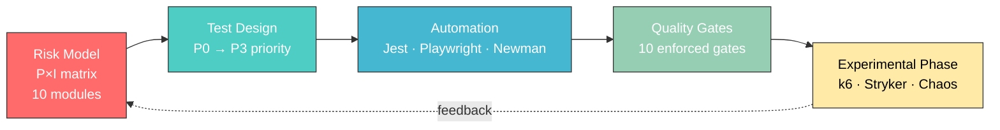

<div align="center">

# 🚀 Rocket.Chat QA — Multi-Phase Quality Engineering Study

### *A Risk-Based, Automated, and Experimentally-Verified QA Pipeline for an Open-Source Communication Platform*

[](https://github.com/illus1um/rocketchat-qa/actions/workflows/assignment3.yml)
[](https://github.com/illus1um/rocketchat-qa/actions/workflows/ci.yml)
[](#)
[](https://nodejs.org)
[](https://docker.com)

[](https://jestjs.io)
[](https://playwright.dev)
[](https://learning.postman.com/docs/collections/using-newman-cli/command-line-integration-with-newman/)
[](https://k6.io)
[](https://stryker-mutator.io)
[](https://github.com/Shopify/toxiproxy)

**🎓 Astana IT University — Group CSE-2505M, Advanced QA**
*Meirambek Yaki · Nurzhan Serikbekov · Aldiyar Sagidolla · SultanBeibarys Kalybekov*
*Instructor: Aigul Adamova*

</div>

---

## ✨ TL;DR

A **longitudinal three-phase QA study** of [Rocket.Chat Community Edition](https://github.com/RocketChat/Rocket.Chat) deployed via Docker Compose with MongoDB 8.
We link **risk assessment → test automation → experimental engineering** into one reproducible pipeline and show that combining all three surfaces operationally significant findings that conventional functional testing alone cannot expose.

> 📄 **Read the full IEEE paper:** [`rocketchat-qa-ieee.docx`](rocketchat-qa-ieee.docx)

---

## 📊 Headline Results

<table>
<tr>
<td align="center" width="25%">

### 🔥 Performance
**188 req/s** @ 50 VUs
p95 = **64 ms** · 0% errors
*(read-heavy, single host)*

</td>
<td align="center" width="25%">

### 🧬 Mutation
**80.81%** score
198 mutants · 159 killed
*on `lib/rocketchat-client.js`*

</td>
<td align="center" width="25%">

### 💥 Chaos
**63.3%** availability under
30s API outage · MTTR **44s**
*4 fault scenarios*

</td>
<td align="center" width="25%">

### ✅ Quality Gates
**10/10 PASS**
13 Jest + 10 Playwright + 14 Newman
*100% pass rate*

</td>
</tr>
</table>

---

## 🗺️ Pipeline at a Glance



Every downstream activity consumes the upstream one and produces evidence that the upstream prediction is **validated, refined, or refuted**.

---

## 📚 Course Deliverables

| # | Phase | Focus | Key Artefacts |
|---|---|---|---|
| **1** | 🎯 Risk Strategy | Probability × Impact model across 10 modules → 3 P0 components | [`docs/risk-assessment.md`](docs/risk-assessment.md) · [`docs/test-strategy.md`](docs/test-strategy.md) |
| **2** | 🤖 UI Automation | Cross-browser Playwright suite + GitHub Actions CI | [`tests/assignment2/`](tests/assignment2/) · [`docs/assignment2-report.md`](docs/assignment2-report.md) |
| **Mid** | 🔌 API Testing | 24 Jest + Axios tests against live Rocket.Chat REST API | [`tests/api/`](tests/api/) · [`docs/midterm-report.md`](docs/midterm-report.md) |
| **3** | 🧪 Experimental | Performance (k6), Mutation (Stryker), Chaos (Toxiproxy) | [`docs/assignment3/`](docs/assignment3/) |
| **4** | 📑 Synthesis | IEEE-format research paper integrating all phases | [`rocketchat-qa-ieee.docx`](rocketchat-qa-ieee.docx) |

---

## 🎯 Risk Model — Top P0 Modules

| # | Module | Prob. | Impact | P×I | Priority |
|---|---|:---:|:---:|:---:|:---:|
| 1 | Real-time Messaging (WebSocket/DDP) | 4 | 5 | **20** | 🔴 P0 Critical |
| 2 | REST API | 4 | 4 | **16** | 🔴 P0 Critical |
| 3 | Authentication & Authorization | 3 | 5 | **15** | 🔴 P0 Critical |
| 4 | End-to-End Encryption | 3 | 5 | 15 | 🟠 P1 High |
| 5 | Database / Data Integrity | 3 | 5 | 15 | 🟠 P1 High |

> Three P0 modules account for **40% of risk-weighted exposure** in only **30% of modules** — risk-based prioritisation in action.

---

## 🧪 Phase 3 — Experimental Engineering

### ⚡ k6 Performance (5 scenarios)

| Scenario | VUs | p95 (ms) | Throughput | Errors | Result |
|---|:---:|:---:|:---:|:---:|:---:|
| Smoke | 1 | 11.76 | 154 r/s | 0.00% | ✅ |
| Load | 10 | 93.59 | 26 r/s | 0.00% | ✅ |
| **Stress** | 10→50 | **64.38** | **188 r/s** | 0.00% | ✅ |
| Spike | 5→60→5 | 127.76 | 172 r/s | 0.01% | ✅ |
| Endurance | 10 | 95.17 | 18 r/s | 0.00% | ✅ |

> **Bottleneck identified:** `chat.sendMessage` write path is **~4.5× slower than reads** (180ms vs 40ms p95) — MongoDB journaling + oplog publication.

### 🧬 Stryker Mutation (`lib/rocketchat-client.js`)

| Module | Mutants | Killed | Score |
|---|:---:|:---:|:---:|
| `errors.js` | 14 | 12 | **85.71%** |
| `retry.js` | 36 | 32 | **91.67%** |
| `validators.js` | 84 | 68 | **80.95%** |
| `rocketchat-client.js` | 64 | 47 | **73.44%** |
| **TOTAL** | **198** | **159** | **🟢 80.81%** |

> Line coverage is ~95% but **31 mutants survive** — empirical confirmation that coverage is a weak proxy for behavioural strength (Inozemtseva & Holmes, ICSE 2014).

### 💥 Chaos Engineering (Toxiproxy + Docker)

| ID | Fault | Duration | Availability | MTTR | Outcome |
|---|---|:---:|:---:|:---:|:---:|
| **C1** | API downtime (`docker stop rocketchat`) | 30s | 63.33% | 44.05s | Container restart |
| **C2** | DB outage (`docker stop mongo`) | 30s | 90.00% | 27.21s | Buffered reads tolerated ~25s |
| **C3** | Network latency (+500ms) | 60s | 100.00% | n/a | Linear propagation |
| **C4** | Severe degradation | 20s | 93.88% | 14.99s | HTTP keep-alive masked toxic |

> 🔍 **Most consequential finding:** `/api/info` is a **liveness** probe, not a **readiness** probe — monitoring built on it silently reports green during a database outage. Discovered only via chaos injection.

---

## 🛡️ Quality Gates — All 10 Enforced

| ID | Metric | Threshold | Observed | |
|:---:|---|---|---|:---:|
| QG01 | P0 API test pass rate | 100% (13/13) | 100% | ✅ |
| QG02 | Playwright E2E pass rate | 100% (10/10) | 100% | ✅ |
| QG03 | Newman assertion pass rate | 100% (14/14) | 100% | ✅ |
| QG04 | Pipeline execution time | ≤ 30 min | ~18 min API · ~25 min E2E | ✅ |
| QG05 | P0 critical defects | 0 detected | 0 | ✅ |
| QG06 | k6 smoke / load p95 | < 800 ms | 11.76 / 93.59 ms | ✅ |
| QG07 | k6 stress p95 | < 2 s | 64.38 ms | ✅ |
| QG08 | Mutation score | ≥ 75% | 80.81% | ✅ |
| QG09 | Chaos C1 availability | ≥ 30% | 63.33% | ✅ |
| QG10 | Chaos C2 availability | ≥ 70% | 90.00% | ✅ |

Enforcement script: [`scripts/quality-gates-assignment3.js`](scripts/quality-gates-assignment3.js)

---

## 🔬 Selected Findings

| ID | Description | Severity | Stage |
|---|---|:---:|---|
| **F-PERF-01** | 3.1 s tail-latency outlier under 50-VU stress (single GC pause) | 🟡 Medium | k6 stress |
| **F-PERF-02** | `chat.sendMessage` ~4.5× slower than reads | 🟢 By design | k6 load |
| **F-MUT-01** | StringLiteral operator only 47% killed | 🟡 Medium | Stryker |
| **F-MUT-02** | ArithmeticOperator 0% killed — retry backoff untested | 🟢 Low | Stryker |
| **F-OBS-01** | `/api/info` reflects process liveness only, not DB readiness | 🟡 Doc/Config | Chaos C2 |
| **F-DOC-01** | Login rate limiter (~5 req/40s/IP) not in CE docs | 🟢 Low | Chaos (incidental) |

---

## 🚀 Quick Start

### Prerequisites
- Node.js 20.x · Docker Desktop 29.x · ~4 GB free RAM

### Spin up Rocket.Chat + MongoDB
```bash
docker compose up -d
# wait for http://localhost:3000 to be ready
```

### Run the full functional suite
```bash
npm ci
npx playwright install --with-deps
npm run test:api        # Jest API tests
npm run test:e2e        # Playwright cross-browser
npm run test:newman     # Postman collection
```

### Run experimental jobs
```bash
# Performance — five k6 scenarios
npm run perf:smoke && npm run perf:load && npm run perf:stress
npm run perf:spike && npm run perf:endurance

# Mutation
npm run test:mutation

# Chaos (requires docker-compose.chaos.yml)
docker compose -f docker-compose.yml -f docker-compose.chaos.yml up -d
npm run chaos:all
```

### Evaluate quality gates
```bash
node scripts/quality-gates-assignment3.js
```

---

## 🗂️ Repository Map

```text
rocketchat-qa/
├── 📄 rocketchat-qa-ieee.docx     ← IEEE research paper (this work)
├── 🐳 docker-compose.yml          ← Rocket.Chat + MongoDB rs0
├── 💥 docker-compose.chaos.yml    ← + Toxiproxy sidecar
│
├── 📁 lib/
│   └── rocketchat-client.js       ← Mutation target (80.81%)
│
├── 📁 tests/
│   ├── api/                       ← 24 Jest + Axios API tests
│   ├── assignment2/               ← Playwright E2E (Chromium + Firefox)
│   ├── unit/                      ← 52 unit tests for the client lib
│   ├── performance/k6/            ← 5 k6 scenarios
│   ├── chaos/                     ← Probe + analyser for fault injection
│   └── postman/                   ← Newman API collection
│
├── 📁 docs/
│   ├── risk-assessment.md         ← Phase 1: P×I matrix
│   ├── test-strategy.md
│   ├── assignment2-report.md      ← Phase 2: UI automation
│   ├── midterm-report.md          ← Midterm: API testing
│   └── assignment3/               ← Phase 3: experimental
│
├── 📁 results/                    ← Raw JSON/JSONL artefacts
│   ├── performance/
│   ├── mutation/
│   ├── chaos/
│   └── quality-gates-summary.json
│
├── 📁 scripts/
│   └── quality-gates-assignment3.js
│
└── 📁 .github/workflows/
    ├── ci.yml                     ← Phases 1–2 + Midterm
    └── assignment3.yml            ← Phase 3 (mutation + perf + chaos)
```

---

## 🧰 Technology Stack

<table>
<tr>
<th>Layer</th><th>Tool</th><th>Why</th>
</tr>
<tr><td>System under test</td><td>Rocket.Chat CE + MongoDB 8 (rs0) + Meteor 3.x</td><td>Reactive, stateful, integration-heavy</td></tr>
<tr><td>API testing</td><td>Jest + Axios</td><td>Built-in assertions, parallel isolation</td></tr>
<tr><td>End-to-end</td><td>Playwright (Chromium + Firefox)</td><td>Auto-wait avoids Selenium brittleness</td></tr>
<tr><td>API collections</td><td>Newman</td><td>Postman-authored, low-barrier contributions</td></tr>
<tr><td>Performance</td><td>k6 (Grafana Labs)</td><td>JS thresholds, CI-friendly</td></tr>
<tr><td>Mutation</td><td>Stryker</td><td>Native Jest runner, per-test coverage</td></tr>
<tr><td>Chaos / fault injection</td><td>Toxiproxy + <code>docker compose stop</code></td><td>Network + service-level faults</td></tr>
<tr><td>CI/CD</td><td>GitHub Actions</td><td>Per-push gates + scheduled experiments</td></tr>
</table>

---

## 📖 Citation

If this work is useful in your research or coursework, please cite:

```bibtex
@techreport{rocketchat-qa-2026,
  title  = {A Multi-Phase Quality Assurance Study of an Open-Source
            Communication Platform: Risk-Based Testing, Automation,
            and Experimental Engineering on Rocket.Chat},
  author = {Yaki, Meirambek and Serikbekov, Nurzhan and
            Sagidolla, Aldiyar and Kalybekov, SultanBeibarys},
  institution = {Astana IT University, CSE-2505M Advanced QA},
  year   = {2026},
  url    = {https://github.com/illus1um/rocketchat-qa}
}
```

---

## 📐 Methodology Disclosure

This paper is honest about the conditions under which the numbers were taken:

- **Single-host deployment** — k6, Rocket.Chat, MongoDB, and Toxiproxy share one Windows 11 host. Latency figures are **relative comparisons**, not production SLOs.
- **Empty database** — fixtures only; the 188 req/s is an upper bound, not a commitment.
- **Modest concurrency** — 50-VU peak is small relative to production. The true write-path saturation point is **uncharacterised**.
- **Mutation target** — Stryker runs against the team's own client wrapper, not the Rocket.Chat source. The 80.81% score belongs to the harness, not to Rocket.Chat itself.
- **Short chaos windows** — 20–60 s scenarios. Compound failures (DB + network) are out of scope for this iteration.

See §XI of the paper for the full limitations discussion.

---

<div align="center">

**🎓 Astana IT University · CSE-2505M · Advanced QA · 2026**

[Report an issue](https://github.com/illus1um/rocketchat-qa/issues) · [Read the paper](rocketchat-qa-ieee.docx) · [View latest CI](https://github.com/illus1um/rocketchat-qa/actions)

*All scripts, configurations, and raw experimental output are committed to this repository for independent reproduction.*

</div>
