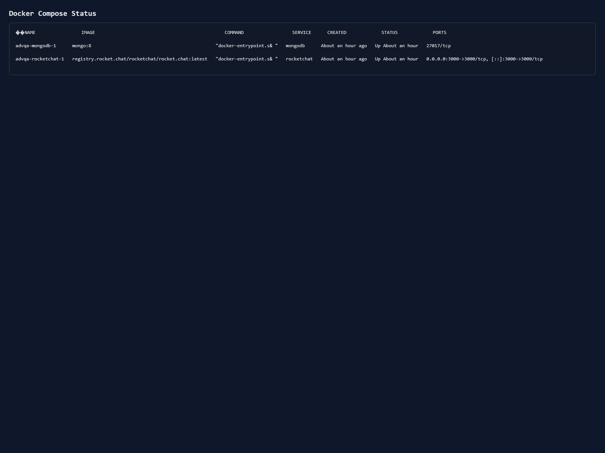
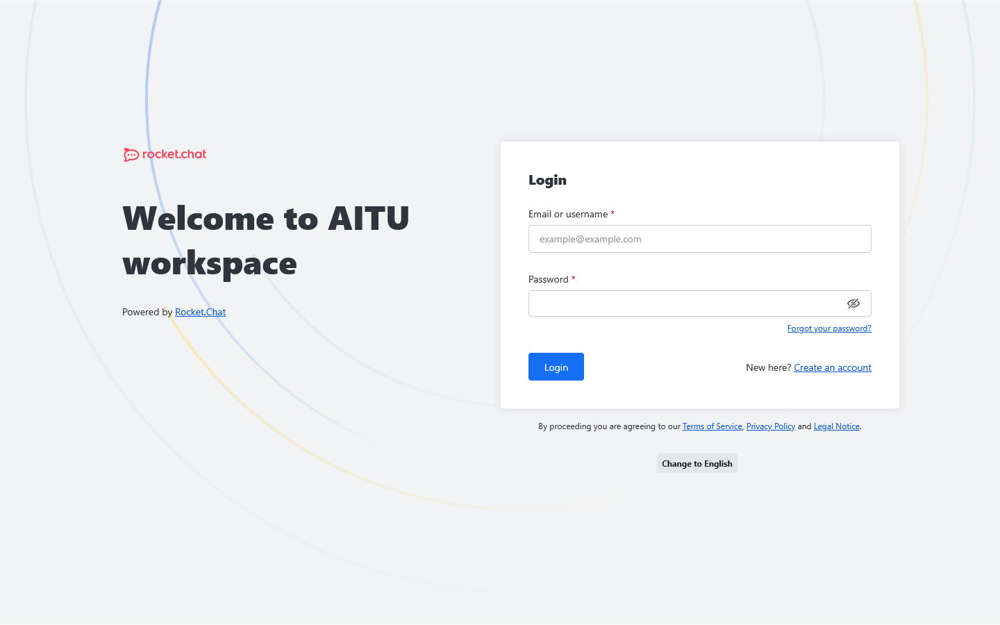
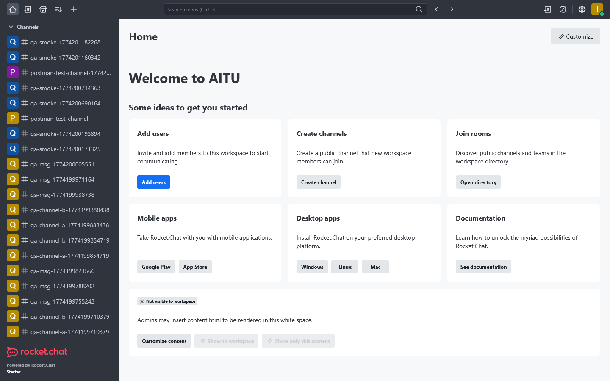
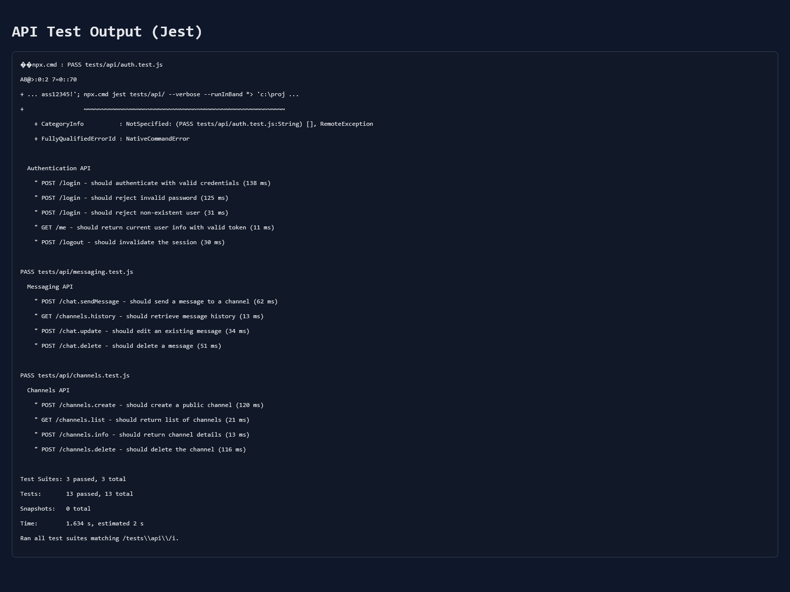
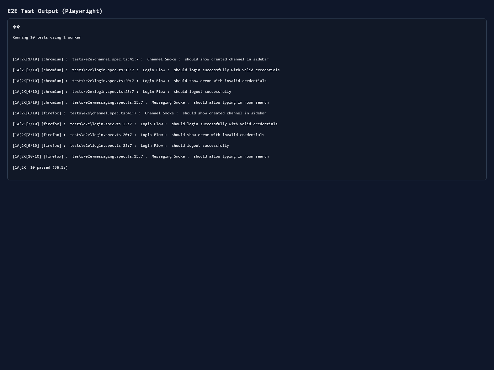
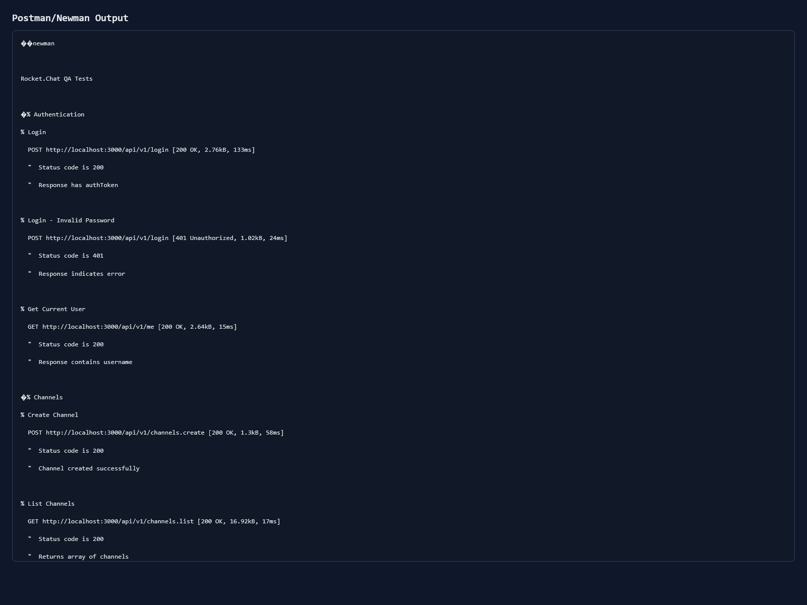
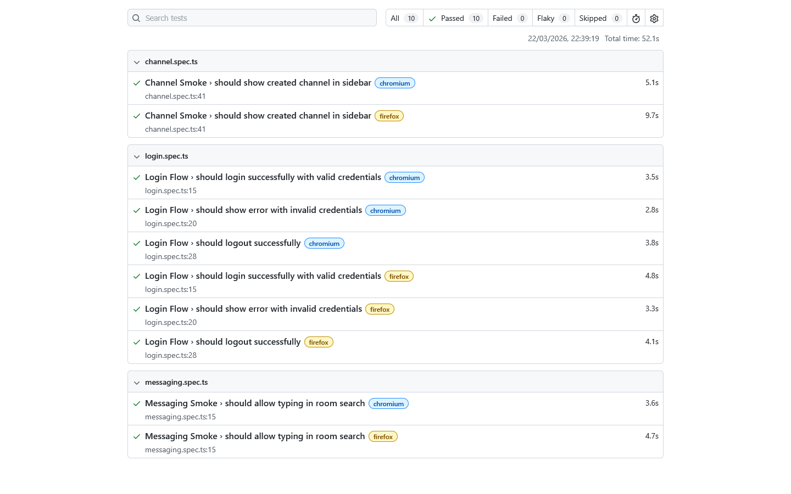

# Assignment 1 Final Report (Advanced QA)

**Course:** Advanced Quality Assurance  
**Instructor:** Aigul Adamova  
**System Under Test:** Rocket.Chat (self-hosted web application)
**Team Members:** Meirambek Yaki, Aldiyar Sagidolla, Nurzhan Serikbekov  
**Group:** CSE-2505M

## Executive Summary

This report consolidates all required Assignment 1 deliverables into a single submission package:

1. Risk Assessment Document (prioritized modules)
2. QA Test Strategy Document (scope, approach, tools, automation plan)
3. QA Environment Setup Report (tools, CI/CD, repository structure)
4. Baseline metrics and evidence screenshots

All core automated checks were executed successfully on the local environment used for this submission.

## Deliverables Mapping

| Required Deliverable | Submission Status | Source |
|---|---|---|
| Risk Assessment Document | Completed | `docs/risk-assessment.md` |
| QA Test Strategy Document | Completed | `docs/test-strategy.md` |
| QA Environment Setup Report | Completed | `docs/environment-setup-report.md` |
| Baseline Metrics + Screenshots | Completed (performance numeric baseline partially pending) | `docs/baseline-metrics.md`, `screenshots/` |

---

## 1. Risk Assessment (Deliverable 1)

### 1.1 System Description

Rocket.Chat is an open-source collaboration platform tested in a self-hosted Docker environment (`rocket.chat:latest` + MongoDB replica set).

### 1.2 Methodology

Risk prioritization used a Probability x Impact scoring model (1-5 for each axis), with module prioritization into P0-P3.

### 1.3 Prioritized Modules (Summary)

| Priority | Count | Modules |
|---|---:|---|
| P0 (Critical) | 3 | Real-time Messaging, REST API, Authentication |
| P1 (High) | 3 | E2E Encryption, Database Integrity, File Upload |
| P2 (Medium) | 2 | Omnichannel, Admin Panel |
| P3 (Low) | 2 | Video/Audio, Push Notifications |

### 1.4 Key Risk-Based Decision

Given deadline constraints and UI instability in Rocket.Chat v8, test implementation prioritized P0 stability first (Authentication/API/Messaging) and reduced deep UI scenarios to a reliable smoke subset.

---

## 2. QA Test Strategy (Deliverable 2)

### 2.1 Scope

**In scope (implemented):**

- Authentication API
- Channels API
- Messaging API
- UI smoke (login, invalid login, logout, channel visibility, search input)
- Postman/Newman API collection smoke

**Out of scope (current iteration):**

- Deep UI edge-case E2E interactions (complex composer/edit workflow)
- Enterprise-only features
- Mobile client testing
- Full JMeter numeric benchmark execution

### 2.2 Test Approach

| Test Layer | Tooling | Current Implementation |
|---|---|---|
| API regression | Jest + Axios | 13 tests |
| UI smoke | Playwright (Chromium + Firefox) | 5 logical scenarios / 10 cross-browser runs |
| API collection | Postman/Newman | 7 requests / 14 assertions |
| Performance (planned) | JMeter | 2 scenarios in `tests/performance/load-test.jmx` |

### 2.3 Planned vs Implemented Automation

The original broader E2E plan was simplified to smoke coverage for consistency under deadline. API automation remained fully implemented and stable.

---

## 3. QA Environment Setup (Deliverable 3)

### 3.1 Environment Configuration

- Docker Compose orchestration
- Rocket.Chat image: `registry.rocket.chat/rocketchat/rocket.chat:latest`
- MongoDB image: `mongo:8`
- Health endpoint: `http://localhost:3000/api/info`

### 3.2 Local Setup Notes

- Rocket.Chat requires first-time setup wizard and admin account creation.
- Admin credentials are injected for tests through:
  - `RC_ADMIN_USER`
  - `RC_ADMIN_PASS`

### 3.3 CI/CD Pipeline

Workflow: `.github/workflows/ci.yml`

- `api-tests` job: Jest + Newman
- `e2e-tests` job: Playwright
- Mongo service aligned to `mongo:8`
- Readiness probe aligned to `/api/info`

### 3.4 Repository Structure

Main folders/files used for this assignment:

- `docs/` (all assignment documentation)
- `tests/api/` (Jest API tests)
- `tests/e2e/` (Playwright smoke tests)
- `tests/postman/` (collection for Newman)
- `tests/performance/` (`load-test.jmx`)
- `.github/workflows/ci.yml` (CI pipeline)
- `screenshots/` (evidence)

---

## 4. Baseline Metrics and Evidence (Deliverable 4)

### 4.1 Baseline Execution Results (Local, 2026-03-22)

| Command | Result |
|---|---|
| `npx jest tests/api --verbose --runInBand` | **PASS** (13/13 tests) |
| `npx playwright test` | **PASS** (10/10 cross-browser runs) |
| `npx newman run tests/postman/rocketchat-collection.json ...` | **PASS** (14/14 assertions) |

### 4.2 Current Coverage Snapshot

- API automated checks: **13 tests**
- E2E smoke checks: **5 logical scenarios**
- Postman collection checks: **7 requests**
- Performance scenarios designed: **2** (pending execution values)

### 4.3 Performance Baseline Status

- JMeter test plan exists: `tests/performance/load-test.jmx`
- Numeric baseline values are pending execution because JMeter CLI is not installed on the current machine.

### 4.4 Evidence Files (Captured)

Located in `screenshots/`:

- `docker-compose-ps.txt`
- `docker-compose-ps.png`
- `login-page.png`
- `home-page.png`
- `api-tests.log`
- `api-tests.png`
- `e2e-tests.log`
- `e2e-tests.png`
- `newman.log`
- `newman.png`
- `playwright-report.png`

### 4.5 Embedded Screenshot Evidence

#### Docker Services Running

#### Rocket.Chat Login Page

#### Rocket.Chat Home Page After Login

#### API Test Results (Jest)

#### E2E Test Results (Playwright)

#### Postman/Newman Results

#### Playwright HTML Report

---

## 5. Assignment Completion Statement

This submission provides all four required Assignment 1 deliverables and a consolidated evidence package.

Completed and verified:

1. Risk assessment and prioritization
2. QA strategy and automation approach
3. Environment setup and CI/CD configuration
4. Baseline metrics with reproducibility artifacts

Pending for next iteration (non-blocking for this deadline package):

- Numeric JMeter benchmark results
- CI web UI screenshot from GitHub Actions run

---

## Appendix: Referenced Documents

- `docs/risk-assessment.md`
- `docs/test-strategy.md`
- `docs/environment-setup-report.md`
- `docs/baseline-metrics.md`

